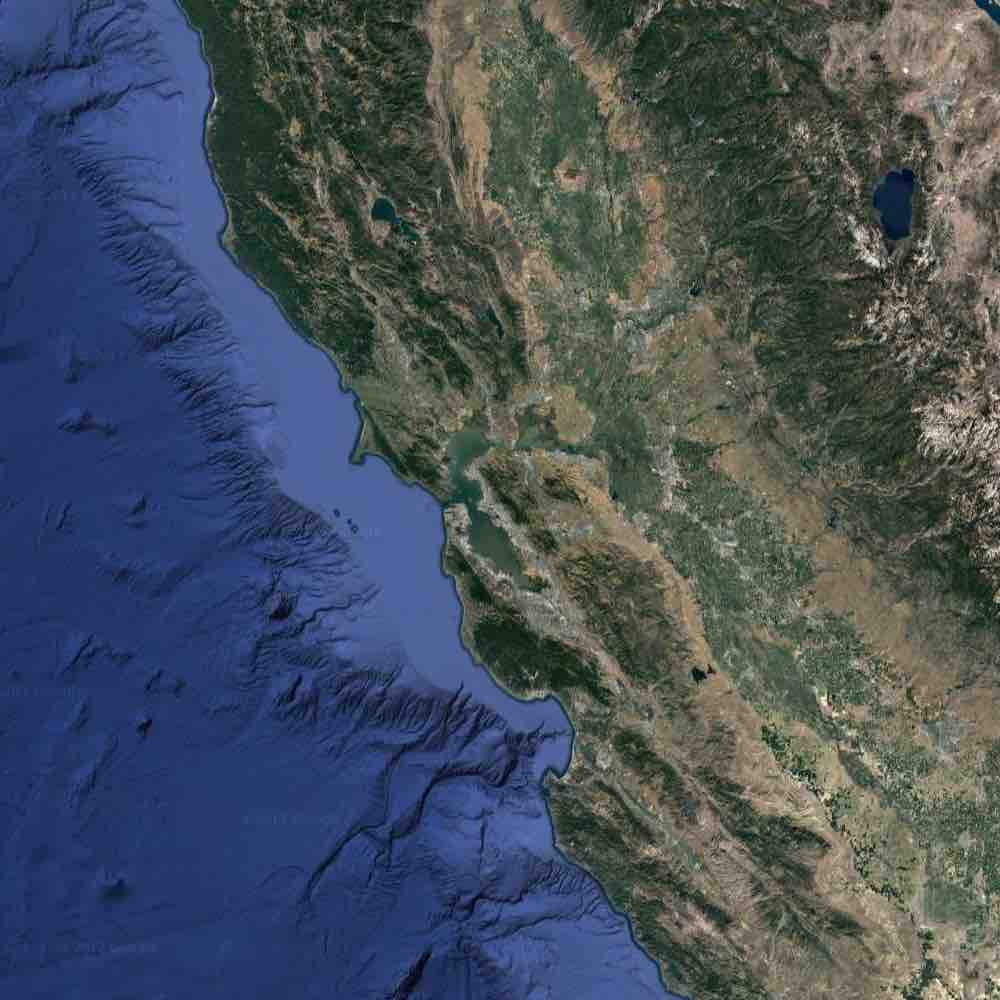
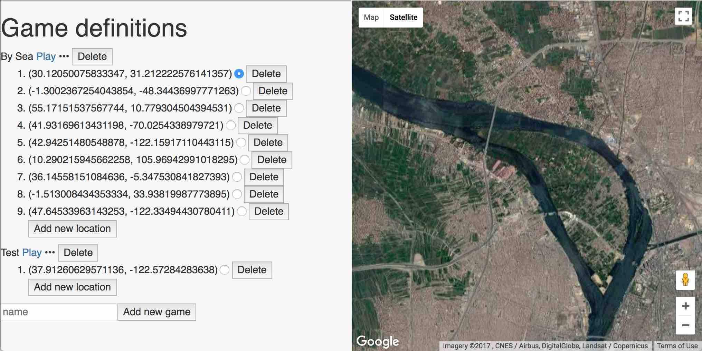
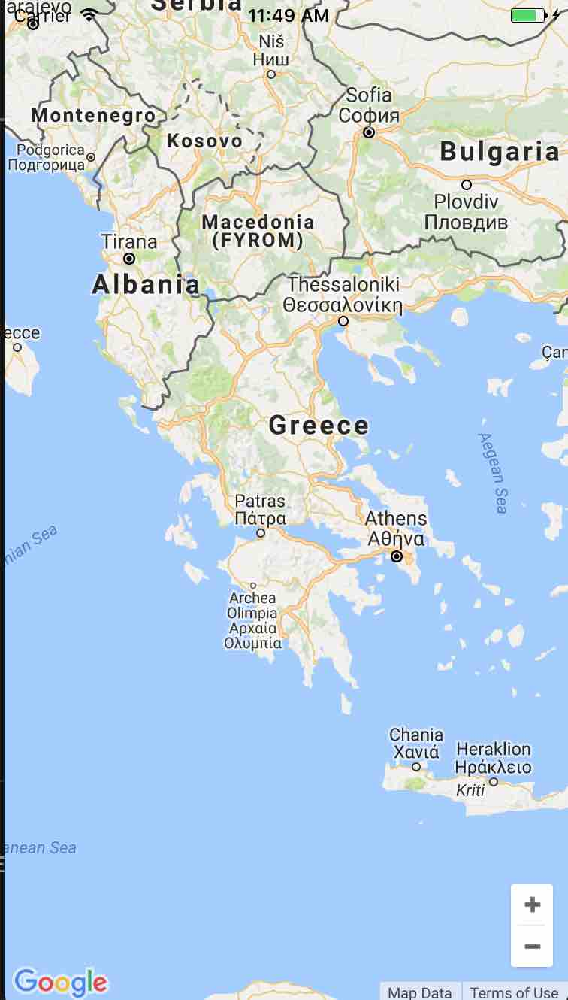

# Where in the World?

A fast-paced multi-player game for people who can't get enough of looking at our beautiful planet.

Built with the [DoubleDutch Development Kit](https://developer.doubledutch.me/hc/en-us/articles/115011666267-Bazaar-Mobile-Developer-Kit) to play with multiple people as an extension inside a DoubleDutch app.

Players compete within the app by centering the map on their mobile device near where they believe the Big Screen satellite view is centered.  The closer you are, the faster you accumulate points, so move quickly as the Big Screen zooms out!

## Components

### Admin

The [admin](./web/admin) page, built with React, can be viewed in the DoubleDutch CMS when this extension isinstalled as an app section in a DoubleDutch event app.

### Play Screen

Click the `Play` link on any game you have created in the admin page to launch the game driver.  Built with React, the Javascript in this page drives the state of the game in several stages:

1. Created - Once created, but not opened for players, you can launch the Big Screen page. Players will see a `Waiting for game` message in the app.

2. Opened - Players in the app are now able to join the game.  The Big Screen will show players who have joined

3. Start - Once started, the Play Screen will drive itself and the Big Screen will progress through zooming out at each location, and showing cumulative scores for all players who have joined.

### Big Screen

From the Play Screen, click the `Big Screen` link. Display this page in Full Screen mode on a screen with your screen saver turned off, visible to all the mobile app users who will be playing.  It will alternate between showing a satellite view of a point on the Earth (as configured in the admin page), zooming out slowly, and a view of the cumulative scores of each player and a graph of scoring trends.

### React Native mobile game

From within your DoubleDutch app, players in a game will see a Google Maps view of the world.  Each player should try to center their map as closely as possible to the point on Earth that she thinks the Big Screen satellite view is showing.

Players get points at each zoom level, so scores will always be increasing.  A player's score increases faster the closer she is to the actual location on the Big Screen, so keep moving the map around as you learn more about where in the world the Big Screen is looking at.

